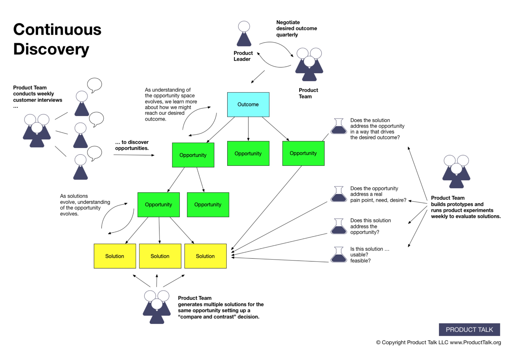
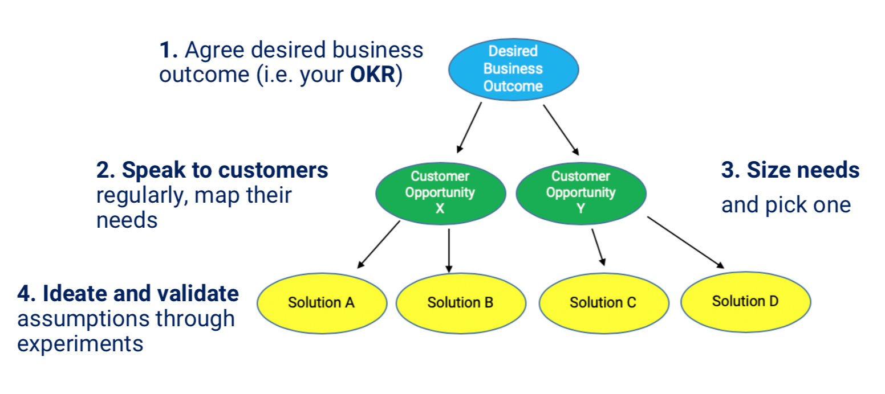
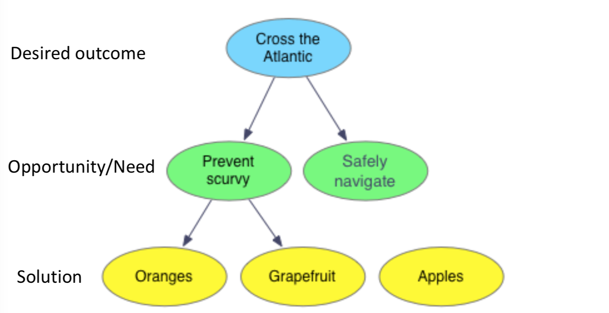
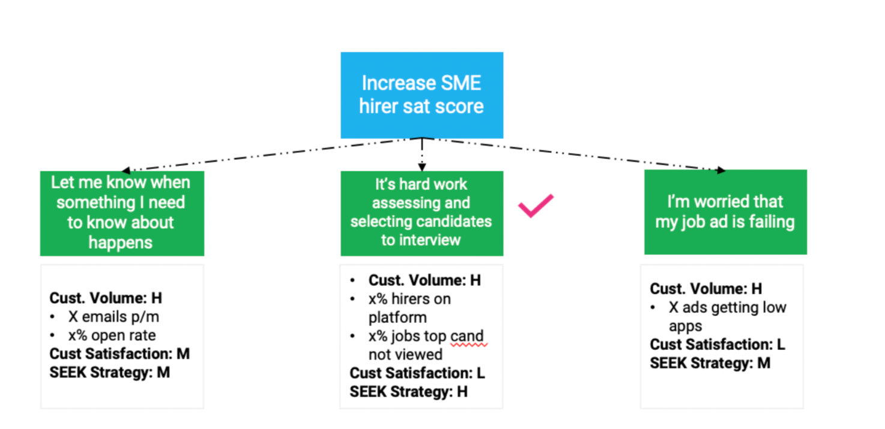
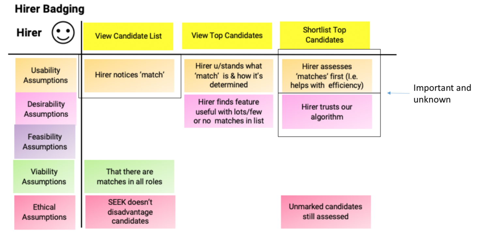
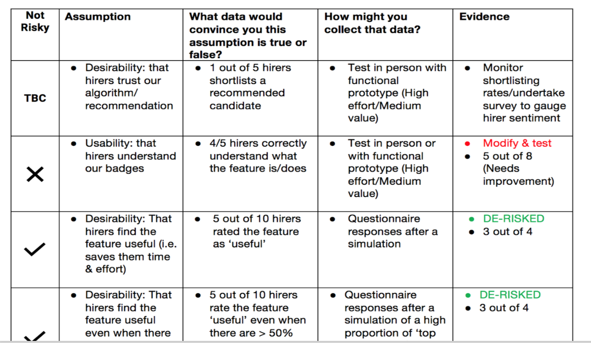

[Caitlin Blackwell](https://www.linkedin.com/in/caitlin-blackwell-8328a623/ "Caitlin Blackwell") gave a [Product Anonymous](https://productanonymous.com/ "Product Anonymous") talk at RMIT on [Continuous Discovery](https://productanonymous.com/2019/07/continuous-discovery-june-wrap-up/ "Continuous Discovery") in June 2019.

Her talk was about her work as acting Head of Product for the candidate experience at SEEK and the coaching they receive from the Continuous discovery coach [Teresa Torres](https://www.producttalk.org/ "Teresa Torres"). The talk described how a product managers role is to decide what to build and then how to build it. Through Agile, Lean Startup etc, we have become really good at building stuff but these frameworks don’t tell us what to build. 

Continuous discovery is about driving better decisions and confidence to the product process. 

Discover what the customer solution needs to be, if you get discovery wrong then all your delivery effort could be wasted. Caitlin believes we encounter villains of bad decision making which include narrow framing, lack of clarity, biases, emotion and overconfidence. 

## Speaking to customers is key

Testing critical assumptions early and often. Caitlin’s teams do five customer interviews ever fortnight where the UX & product teams combine to learn about their customers and test possible solutions. Insights are then shared across standups. 

**Value**: do customers want it. **Usability**: How easy is it to use. **Feasibility**: How costly or time consuming is it to deliver. **Viability**: Are there business contracts that block the solution. **Ethical**: Is it the right thing to do

## Opportunity solution tree map
Starts with the behaviour change outcome and metric that is your desired outcome. Then branch off to possible opportunities which are linked to customers needs and show possible solutions that may help them reach the behavioural gaol. 

### How can we be right more
1. Agree an shared Outcome (OKR)
2. Speak to customers 
3. Score/size their need
4. Ideate and validate possible solutions

### Agree an desired Outcome (OKR)
- Behaviour based objectives 
- Set a Key results which experiments can be measured against to know if they are successful or not
- Key idea or initiative are possible solutions can contain multiple experiments to test

## Speak to customers 
Because we are making product decisions daily, the only way to know if our decisions are having the desired outcome is to run regular customer interviews. Interview customers to understand customers and map their needs. Understand what their desired outcome is and what are their needs in completing that goal. Which will identify possible solutions. Test ideas and possible solutions with them to see if their needs are been met and if the solution helps them achieve their outcome. 

### Once needs have been identified, Score/size them
- Impact: is it Above the fold, Noticeable with in five seconds, Adding or removing an element, Designed to increase users motivation, Running on high-visited page.
- Supporting data: How much Quantitive, Qualitative, Feedback, Analytics, Heatmap and scroll map data is there 
- Level of effort: How costly or time consuming is it 
- Does the opportunity align to the business strategy: PG / lead ref / three voices; Increasing new & existing student enrolments; Improving site experience

### Ideate and validate possible solutions and assumptions
- Spend five minutes a day to brainstorm. Frequently spending a short time is less cognitively draining than an hour brainstorm!
- Do what you can to learn quickly in order to move forward. Talking with two customers is better than no customers. You can still learn something from those two (sample size is important but you can learn and be smart about what you’re hearing from small numbers)

Map your assumptions! Run tests on how you validate/disprove each of them.

## Continue reading
- An introduction to Modern Product Discovery & [more resources](https://producttalk.org/ "more resources") – Teresa Torres
- [Decisive](https://www.amazon.com/Decisive-Make-Better-Choices-Life/dp/0307956393/ref=sr_1_1?ie=UTF8&qid=1359566960&sr=8-1&keywords=decisive "Decisive") by Chip & Dan Heath
- [Inspired](https://www.booktopia.com.au/inspired-marty-cagan/prod9781119387503.html?source=pla&gclid=CjwKCAjwx_boBRA9EiwA4kIELq0wIzutBr49---NAKtFgmxSJnZYk_-vJRTL8CiHb5Ion6E2oS4u5xoCIMAQAvD_BwE "Inspired") by Marty Cagan
- Introducing the [Behavioural Product Manager](https://medium.com/behavioral-economics-1/move-over-product-manager-introducing-the-behavioral-product-manager-ab8612f45ae8 "Behavioral Product Manager")

