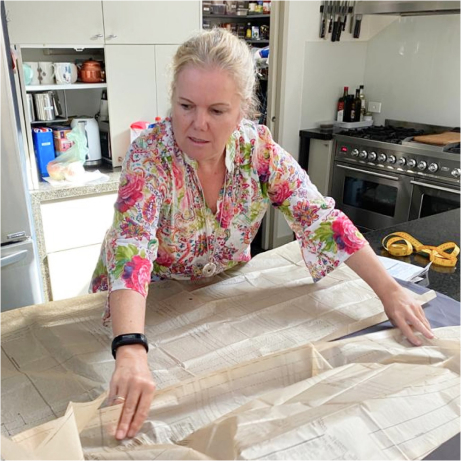

# [Rona Scrubs is a registered not for profit charity](https://www.acnc.gov.au/charity/864bd8992c17296f9734c335f46cb4e6)

Established on 1 April 2020 in response to the COVID-19 pandemic reaching Australia’s shores and feedback from healthcare workers that they were unable to obtain scrubs to help them prevent the spread of COVID-19. Operations were wound up on 31 July when we completed 100% of orders.

At its core Rona Scrubs was a grassroots charity – starting on Facebook as friends making scrubs, grew through the website I lead the customer experience to create over 6,500 free scrubs for healthcare workers across Australia with the help of over 3,000 volunteers and generous donors in 61 days.

_“I appreciate your work to all frontline healthcare professionals in 2020. The scrubs are very comfortable and I am so proud to wear them at workplace. The world is different because of you, thank you again for your time and contribution to the local community.”_

### The impact of Rona Scrubs has been far greater than I ever imagined

Whilst the core aim to start was to help support healthcare workers minimise the potential spread of COVID it also quickly became and important refuge for many volunteers. Providing them with focus, purpose and friendship to get through the challenging times we were all facing. The psychological benefits to volunteers in participating far exceeded the original expectations of the founder and core team that made Rona Scrubs happen.

_“A very heartfelt thank you. It has been hard to source decent scrubs the past few months, I feel so lucky!”_

The core team behind Rona Scrubs was made up of Annabelle the founder, Kate Marketing Lead, Charlotte Healthcare lead, Nicola Operations lead and myself Customer experience lead. I was responsible for making the react website that allowed Healthcare to register their need of scrubs and volunteers the ability to sign up. After they registered on the site they receive our automated and campaign email journeys to know what was required in their local suburb across Australia.       

Rona Scrubs has been an [amazing success](https://www.facebook.com/watch/?v=754354945301805). We have far exceeded even our wildest dreams when we started. We have successfully enabled countless Australians to feel connected with purpose during one of the most challenging period in Australia’s contemporary history and share positivity, care and a sense of community. The number of healthcare workers and volunteers that have been involved speaks volumes for the successful outcomes of the initiative – as does the overwhelming gratitude and heartfelt thanks we receive from healthcare workers.

_“I am testing patients for covid 19, so the scrubs I received will be my special outfit. It's important to wear something that I can take off after the shift to wash, so I don't bring anything nasty back home. Love you all. Please stay safe. Xx”_

There were many challenges on the journey, but the team that brought Rona Scrubs to life and helped thousands of volunteers and healthcare workers were formidable. Some notable challenges include:
- Many sewing volunteers were in a higher risk category for COVID-19 infection. This was a critical concern for the team as they were determined to ensure that involvement did not encourage anyone to leave home unnecessarily. To that end, they worked tirelessly to obtain supplies and provide them to volunteers wherever possible so that the least number of volunteers needed to leave home. Digital patterns and instructions were created, an amazingly supportive Facebook community was created to help support volunteers as they ran into issues, distributors were appointed to help take supplies to sewing volunteers and collect from them (and quality check scrubs for their suitability and then deliver them to healthcare workers).
- Dealing with the ever changing lockdown constraints  (particularly in Melbourne) were a challenge – in response we garnered further donations to help us post more scrubs out to areas where our distributors lived in lockdown suburbs and we felt it was irresponsible for them to travel
- Keeping all our volunteers supported during some really challenging times and not burning themselves or our core team out was hard work. With volunteers having a huge level of engagement and time on their hands being stuck at home we found that they needed a lot more help than normal.

_“Thanks very much for my lovely scrubs I received. You are all so kind to spend some time and effort to make them. God bless to all of you.”_

Rona Scrubs has left a lasting impact on every one of our volunteers – it has helped them feel proud of how they have tried to help Australia get through COVID-19. It has also left a lasting impact yon our healthcare workers who have received scrubs, many citing that Rona Scrubs has renewed their faith in humanity and their sense of care from the community they are working so hard to protect. Ultimately, we also help that Rona Scrubs will, over the long term, help us minimise the transmission of COVD19 in Australia and help protect our healthcare workers in some small part from getting or bringing COVID-19 into their homes and communities.