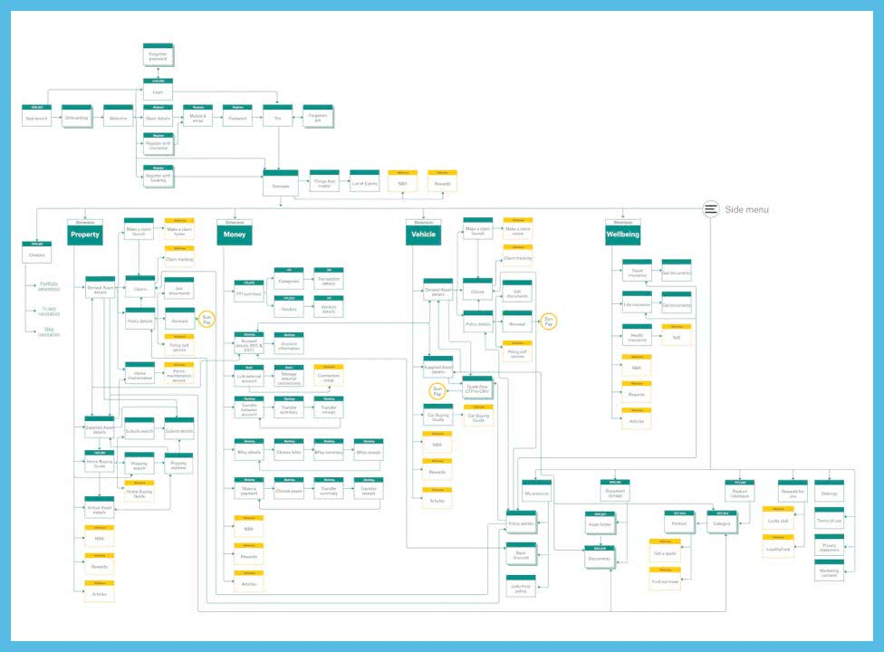
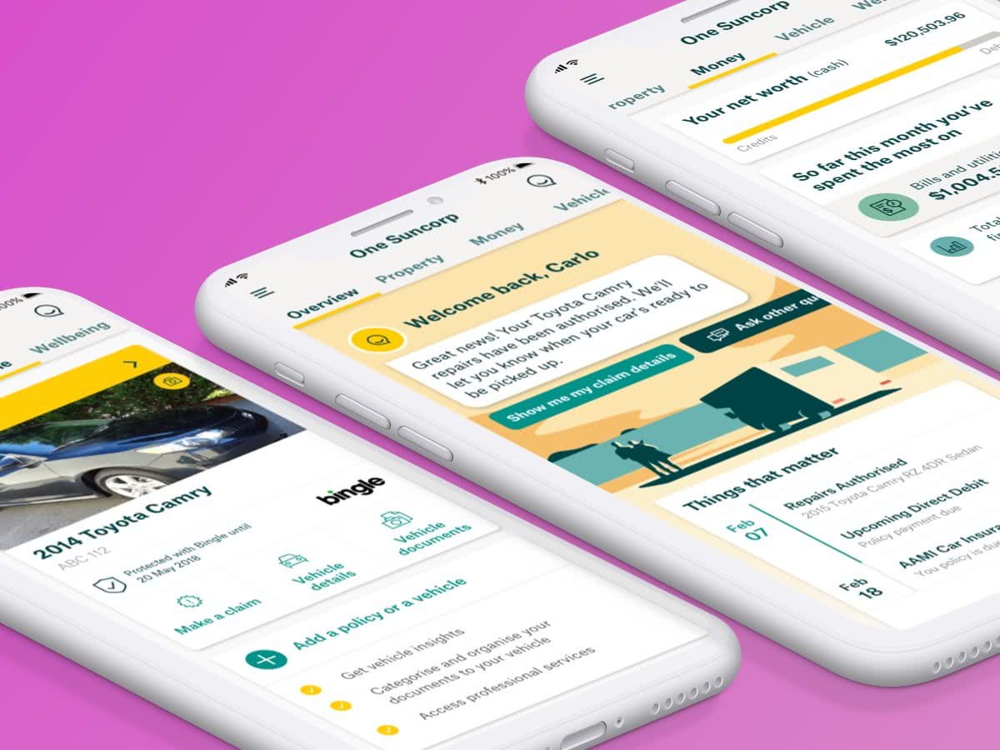

### A single destination

For customers to manage their financial well-being. Enable them to see, store and do everything to manage their money, home, car and health needs in one place.

Designed to make it easier for customers to achieve financial wellness and consolidate the Suncorp Group network of brands into one single app.

The native iOS and Android app combined the functionality for Suncorp, AAMI, GIO, APIA, Shannons, Bingle and CIL existing mobile apps into one. A single destination and tt’s the place to get your home, car, money and life sorted.

View the app on [iOS](https://apps.apple.com/au/app/suncorp-app/id1383025759) and [Android](https://play.google.com/store/apps/details?id=au.com.suncorp.marketplace&hl=en_AU&gl=US)

<Vimeo vimeoId="285677207" />

### Discovery and experiments phase

I started at the beginning of the engagement in late August 2017 and meet the product owner who had a bucket list features and a 30 June 2018 deadline.

We ran the project dual track and I started leading the discovery phase. Running workshops, talking to customers and experimenting with concepts.

One of the first aspects we looked at was the main navigation from standard to custom patterns. To simplify a complex registration flow and allow customers to access the app from seven brands credentials.

Throughout discovery, we continually gathered feedback from customers. We tested everything from the value proposition, the navigation concepts to the desirability of individual features.

#### How it all hangs together
To communicate the overall picture of how all the features in the app would connect together and be accessed. I worked closely with the product owner and technician architects to design the information architecture in the form of an app map. It’s here the core pillars of the app can be seen and how the features hang together.
    
#### Senior leadership presentations
On projects of this size, communication is key and I was providing my stakeholder's holder with user testing summaries and prototypes of key experiences to present at their Senior Leadership team monthly updates.

### Design for development
As the project moved into development. The team size grew to seven development pods across three states. Each pod developing features for iOS and Android natively.

I pivoted from discovery to creating wire flows, a series of screens linked by interactions and states for development. I worked on features from the categorisation of transactional banking to the overview and property sections. Finalising the interactions  with the product owners and technical architect for each platform. Mapping existing services from API’s to features or requesting new data to support new services.

#### Production designs
After setting the vision, I was responsible for keeping consistency within the app across multiple design teams in three different locations. Along with the UI lead, we ran multiple checkpoints. From peer crits, design reviews with the client and showcases.

### App launch 🚀
- The iOS and Android apps launched with a fast and secure access to bank accounts. Categorised transactions, transfer money, pay bills and make payments.
- Self-serves across Car, Home and Life Insurance, from updating address, pay renewals and new quotes. Make a claim and to be able to track the entire process from start to finish.
- Suncorp App’s also has a Virtual Assistant chatbot powered by Microsoft Watson to answer questions about specific bank accounts and insurance policies.