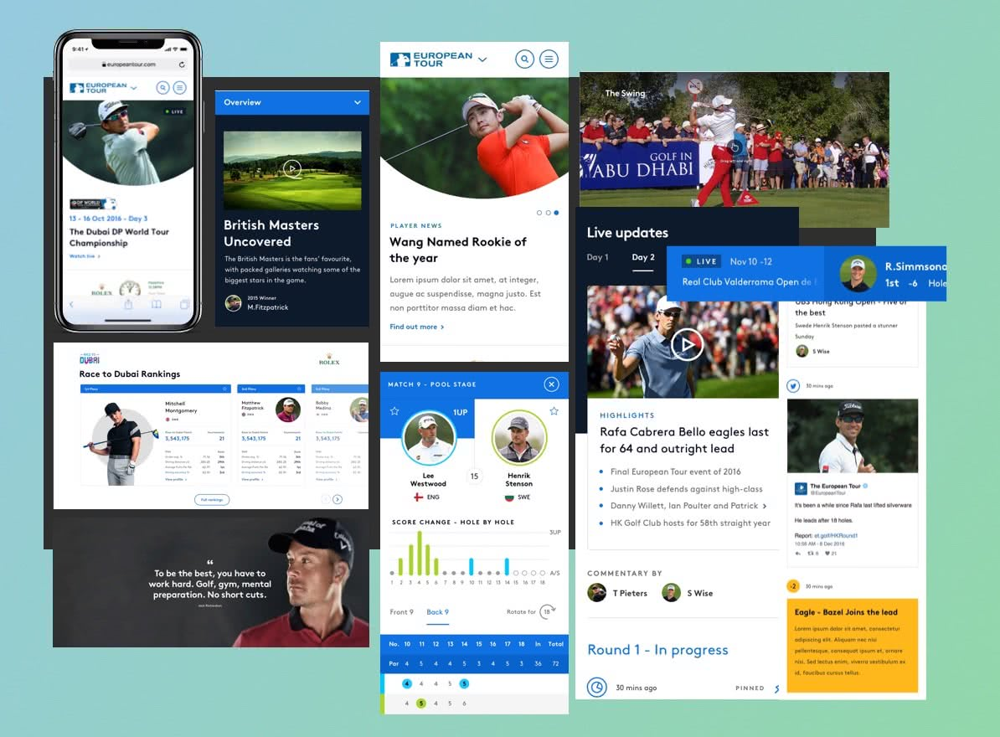

## European tour website
The PGA wanted a new website to showcase the live, at-event experience of their premiere golf stage - The European Tour.

This would be quite some feat because The European Tour competition is a year-long Race to Dubai, where the winner is crowned and covers 47 tournaments across 26 countries.

 ### Approach
 Working in small teams, we designed the site one section at a time. I lead a visual and UX team across key pages in five intensive two-week sprints.

 In each sprint, we defined and overcame challenges by interviewing stakeholders; refining ideas and presenting wireframes and flows to the client throughout.

 <Vimeo vimeoId="205206244" />
 Employing InVisions Craft to keep the teams aligned and storing our component library in Zeplin, we built prototypes of the interactions; from micro-interactions to full page flows.

 These accompanied annotations and production access of the design ready to be built in Sitecore.

 <Vimeo vimeoId="205206187" />

## Solution
We delivered a site with performance at its heart, to serve the fans with the first and fastest live scores and the latest news from nearly fifty tournaments around the world.

The multi-faceted site incorporates real-time leaderboards, video replays, galleries, player profiles and up-to-the-minute written word articles so golf fans can follow all the action as if they were teeing off next to the pros at The Masters or Ryder Cup themselves.
