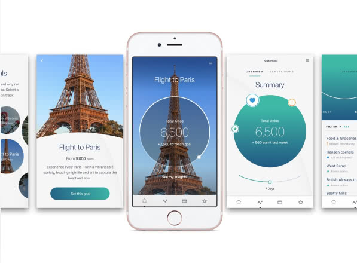
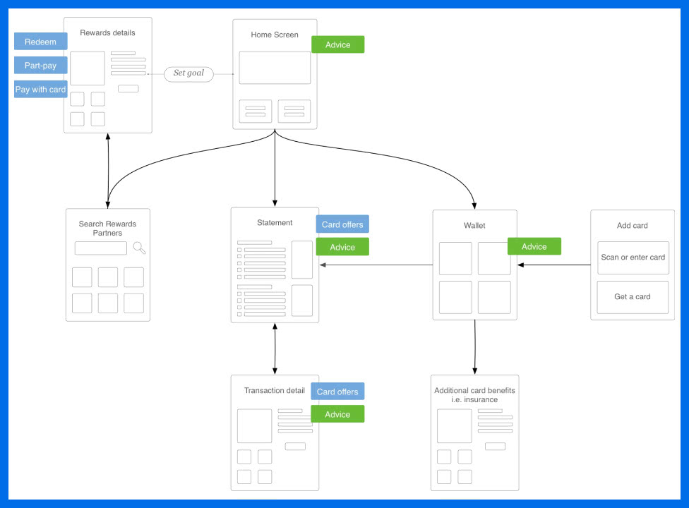
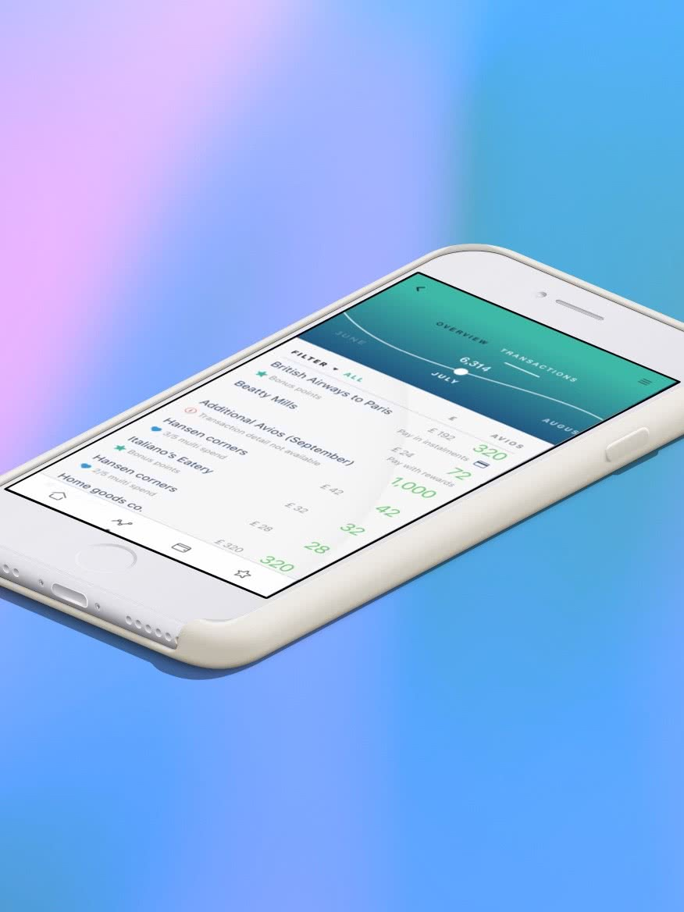

MasterCard wanted to expand their business into the loyalty programme sector, so needed a prototype app they could pitch to other businesses.
 
To compete in a marketplace famed for high uptake and dwindling users, MasterCard were going to need something special - a product that could rekindle the romance between loyal customer and reward points.

Therefore, our challenge was twofold. Not only did they require a stunning, easy to understand, engaging product but in order to succeed, it was going to have to revolutionise the loyalty programme industry.

<Vimeo vimeoId="203381109" />

### Our approach
Before I could even begin overseeing this end-to-end user experience, the first problem to figure out was why this disconnect between high uptake and low points collection was happening.

My research began by running stakeholder workshops and interviewing customers to define both the client's and end-customer’s needs.

Luckily, I was able to identify the core issues almost immediately:
      
 - Customers did not understand the value of their points; we needed to demystify the whole process and highlight missed opportunities with a bank statement-like option.
- People sign up with airline credit cards to accumulate air miles or save for specific goals. We needed to help them set goals more easily, utilise time frames and encourage social  media sharing.
- Naturally, people’s use of credit cards changes as their lifestyle changes. At present there was no way for the loyalty programme to react to this. The right app needed to capture relevant data to understand when these changes occur, then launch personalised, targeted offers accordingly.

We delivered a high-fidelity, interactive, clickable prototype or customers to access via their smartphones. Featuring 48 demo screens which could be used in a free flow manner via our hidden, built-in menu system to start each journey.

We created bespoke a micro-interaction pattern system featuring ‘confirmation button behaviour’ to give customers a strong feeling of completion.

I designed and lead my team to create visuals for a high-fidelity prototype

We showcased an amazing app which featured a dynamic transaction history, a digital wallet and tailored rewards. Utilising clean, modern circle design to help guide customers though every stage of the app and leave them with a unique and satisfying user experience.

Using our prototype, Mastercard went on to pitch to other businesses including British Airways, Virgin, Avios and Lloyds Bank.

I’m proud of the product we created, the valuable opportunities it provides to our client and their customers.