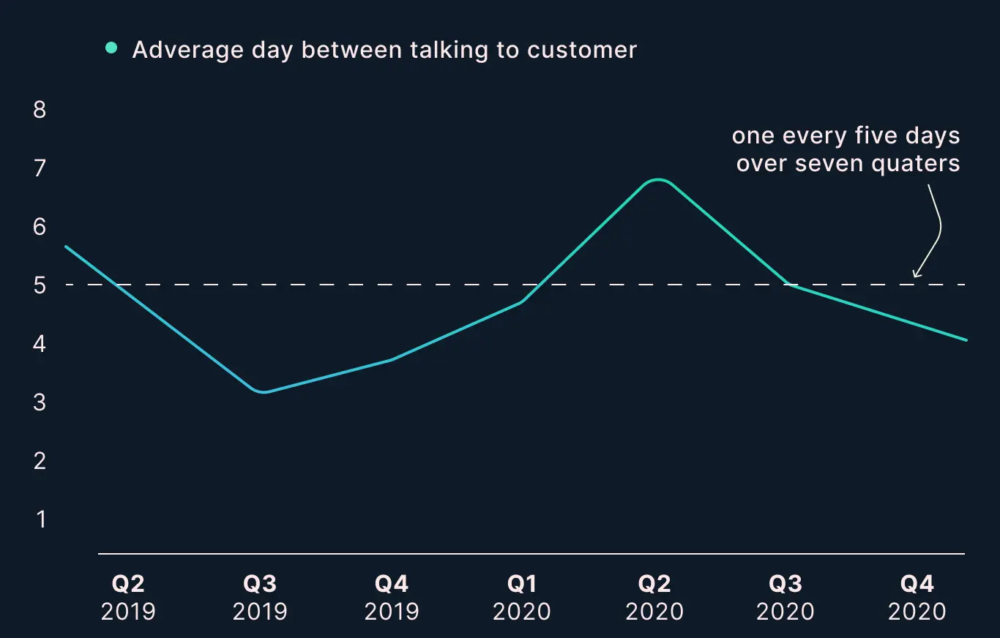

# A continuous discovery practice 
Through Agile, Open Universities Australia had become fantastic at building stuff, but this framework doesn’t say what to build. When I joined, there was little to no discovery and at best it was an ad-hoc approach on a feature by feature bases.  Within my first quarter, I started and developed a continuous practice of engaging with customers. Over the past seven quarters I’ve maintained a rolling cadence of talking to students and prospects on a weekly basis.
 

## To create a good discovery practice 
I started by crafting research questions to drive product outcomes. By mapping product teams OKRs to opportunities and identifying assumptions. Prioritising those critical assumptions and testing them early and often. To iteratively exploring these ideas, de-risking and shipping more value often.

> [Measuring metrics](https://www.producttalk.org/2020/06/measure-discovery/ "Measuring metrics") only work if they truly are leading indicators of our lagging indicator—driving our desired outcomes. 
~ Teresa Torres

## Speaking to customers is key
Continuous discovery is about driving better decisions and confidence to the product process. By creating a good discovery practice that drives outcomes. Reduces risk and builds confidence in the goal, I’ve helped lead teams to hitting more outcomes more consistently. 

## To get the best out of discovery activities 
I’ve had to build trust with the insights. In a culture that preferred quantitive data, I needed to show the value of qualitative research by giving a voice to those individuals, the jobs they were trying to achieve and experience they had with our products.
The hardest part was to change mindsets that assumptions about the data can be wrong. Once Product Managers and Engineers started to see alternatives they were more open and conversations about what we were learning became unbiased, even contradicted some well established hypothesis.

> If you're not prepared to be wrong, you'll never come up with anything original.
~ Ken Robinson 

Now we’re able to work backwards from a business outcome, connecting the dots from what we learn in regular customer interviews to the product decisions we make. 

Whilst we’ve been measuring the effectiveness of our discovery activities, each quarters by how many days has it been between speaking to a customer. I’m working towards, measuring how long it has been since we last killed an assumption. To celebrate these learnings that move us forward. 

